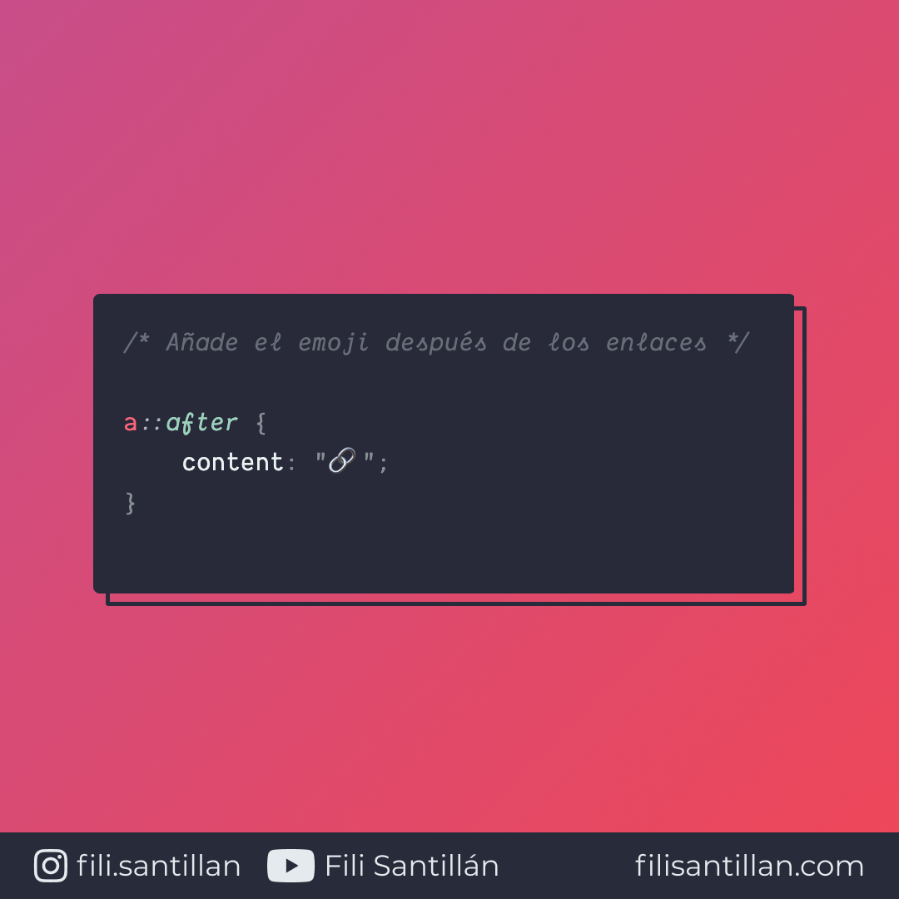

# `:after`

`::after` es un pseudo-elemento que permite agregar contenido después de un elemento, sin necesidad de que exista código HTML. A pesar de que no existe en el DOM, es visible en el sitio web.

Bit completo en: [filisantillan.com](https://filisantillan.com/bits/after/)

> Código utilizado en el ejemplo: [after.css](./after.css)

## 🤓 Aprende algo nuevo hoy

> Comparto los **bits** al menos una vez por semana.

Instagram: [@fili.santillan](https://www.instagram.com/fili.santillan/)  
Twitter: [@FiliSantillan](https://twitter.com/FiliSantillan)  
Facebook: [Fili Santillán](https://www.facebook.com/FiliSantillan96/)  
Sitio web: http://filisantillan.com

## 📚 Recursos

- [MDN ::after](https://developer.mozilla.org/en-US/docs/Web/CSS/::after)
- [CSS-Tricks ::before / ::after](https://css-tricks.com/almanac/selectors/a/after-and-before/)
